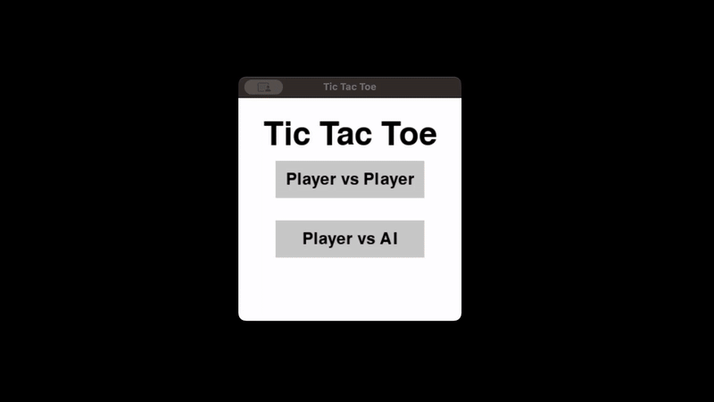

# Tic-Tac-Toe with AI

A classic Tic-Tac-Toe game built with Python and Pygame, featuring both Player vs Player and Player vs AI game modes. The AI opponent uses strategic decision-making to provide a challenging experience.

## Demo



## Features

- **Two Game Modes**
  - Player vs Player: Take turns playing on the same device
  - Player vs AI: Challenge an AI opponent with strategic gameplay

- **Intelligent AI Opponent**
  - Prioritizes winning moves
  - Blocks opponent's winning moves
  - Uses strategic positioning (center preference)
  - Randomized first move for variety

- **Clean User Interface**
  - Visual grid with custom X and O graphics
  - Clear game state messages (winner, tie)
  - Menu system for mode selection
  - Play Again functionality

- **Well-Structured Code**
  - Object-oriented design with separate classes for game components
  - Modular architecture (Grid, Player, AI, Button, Message classes)
  - Easy to extend and modify

## Technologies Used

- **Python 3.x**
- **Pygame 2.x** - Game framework for graphics and input handling
- **Object-Oriented Programming** - Clean class-based architecture

## How the AI Works

The AI uses a simple but effective strategy with the following priority:

1. **First Move**: Makes a random move to add variety
2. **Win Detection**: If AI can win in the next move, it takes it
3. **Block Opponent**: If player can win in the next move, AI blocks it
4. **Center Control**: Takes the center cell if available (strategic advantage)
5. **Random Available**: Takes any remaining empty cell

The AI's decision-making is implemented in the `_find_winning_move()` method, which simulates placing symbols to detect winning positions.

## What I Learned

Building this project reinforced several important concepts:

- **Game State Management**: Tracking turn order, win conditions, and game flow across multiple states (menu, active game, game over)
- **AI Logic**: Implementing lookahead logic to detect winning/blocking moves by simulating potential placements
- **Event-Driven Programming**: Handling different events (mouse clicks) based on current game state
- **Clean Code Architecture**: Separating concerns into focused classes (Grid manages board state, AI handles computer moves, Game orchestrates everything)

## How to Run

### Prerequisites

- Python 3.6 or higher
- Pygame library

### Installation

1. Clone this repository:

```bash
git clone https://github.com/a-maystorov/tic-tac-toe.git
cd tic-tac-toe
```

2. Install dependencies:

```bash
pip install pygame
```

3. Run the game:

```bash
python game.py
```

### Project Structure

```
tic-tac-toe/
│
├── game.py          # Main game loop and orchestration
├── grid.py          # Grid/board management and win detection
├── ai.py            # AI opponent logic
├── player.py        # Player class for rendering symbols
├── button.py        # UI button component
├── message.py       # Text message rendering
├── settings.py      # Game configuration
│
└── images/
    ├── x.png        # X symbol graphic
    └── o.png        # O symbol graphic
```

## Controls

- **Mouse Click**: Select game mode, place symbols, or click "Play Again"
- Click on any empty cell during your turn to place your symbol

## Game Rules

1. The game is played on a 3x3 grid
2. Players take turns placing their symbol (X or O)
3. First player to get 3 of their symbols in a row (horizontally, vertically, or diagonally) wins
4. If all cells are filled with no winner, the game is a tie

## Future Improvements

- [ ] Add difficulty levels for AI (Easy, Medium, Hard)
- [ ] Implement full minimax algorithm with alpha-beta pruning for unbeatable AI
- [ ] Add sound effects and animations
- [ ] Track win/loss statistics across multiple games
- [ ] Add online multiplayer mode
- [ ] Implement different board sizes (4x4, 5x5)
- [ ] Add themes and customizable graphics

## Code Highlights

### AI Win Detection Logic

```python
def _find_winning_move(self, player):
    """
    Try placing the player's symbol in each empty cell,
    check if it creates a win, then undo the placement.
    Returns the winning position if found.
    """
    for row in range(3):
        for col in range(3):
            if self.grid.cells[row][col] is None:
                # Simulate placing the symbol
                self.grid.cells[row][col] = player

                # Check if this creates a win
                is_winning = self.grid.check_winner() == player

                # Undo the simulation
                self.grid.cells[row][col] = None

                if is_winning:
                    return (row, col)
    return None
```

This lookahead technique is fundamental to game AI and forms the basis of more advanced algorithms like minimax.

## License

This project is open source and available under the [MIT License](LICENSE).

## Author

**Alkin Maystorov**

- GitHub: [@a-maystorov](https://github.com/a-maystorov)
- Portfolio: [alkinmaystorov.com](https://alkinmaystorov.com)
- LinkedIn: [Alkin Maystorov](https://linkedin.com/in/alkin-maystorov)

## Acknowledgments

- Built as part of learning game development with Python and Pygame
- Inspired by the classic Tic-Tac-Toe game
- AI strategy based on common game theory approaches
